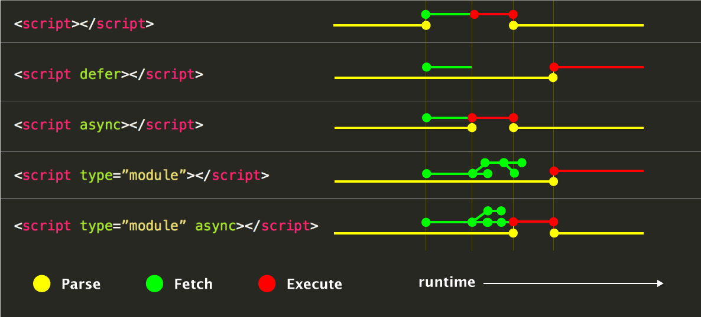

# Render Blocking

## Types of render-blocking URLs

A `<script>` tag

* Is in the `<head>` of the document
* Does not have `defer` attribute
* Does not have `async` attribute

A `<link rel="stylesheet">` tag that:

* Does not have a disabled attribute. When this attribute is present, the browser does not download the stylesheet.
* Does not have a media attribute that matches the user's device.

A `<link rel="import">` tag that:

* Does not have an async attribute.

## Details

## Async Vs Defer

Important points

* `type="module"` by default is defered. To make its behaviour as `async`, put the attribute.
* `async defer` both exists, modern browser will execute `async` and the older browser will fallback to `defer`.

> There are three possible modes that can be selected using these attributes. If the async attribute is present, then the script will be executed asynchronously, as soon as it is available. If the async attribute is not present but the defer attribute is present, then the script is executed when the page has finished parsing. If neither attribute is present, then the script is fetched and executed immediately, before the user agent continues parsing the page. Refer: [w3 specs here](https://www.w3.org/TR/2011/WD-html5-20110525/scripting-1.html#attr-script-async)



## Defer non-critical Stylescheets

```markup
<style type="text/css">
.class-imp {
  /* Classes important for first page render */
}
</style>

<link rel="preload" href="styles.css" as="style" onload="this.onload=null;this.rel='stylesheet'">
<noscript><link rel="stylesheet" href="styles.css"></noscript>
```

* `link rel="preload" as="style"` requests the stylesheet asynchronously. You can learn more about preload in the Preload critical assets guide.
* The `onload` attribute in the link allows the CSS to be processed when it finishes loading.
* "nulling" the `onload` handler once it is used helps some browsers avoid re-calling the handler upon switching the rel attribute.
* The reference to the stylesheet inside of a noscript element works as a fallback for browsers that don't execute JavaScript.

## render blocking CSS

## References

* [https://developers.google.com/web/fundamentals/performance/critical-rendering-path/render-blocking-css](https://developers.google.com/web/fundamentals/performance/critical-rendering-path/render-blocking-css)
* 
