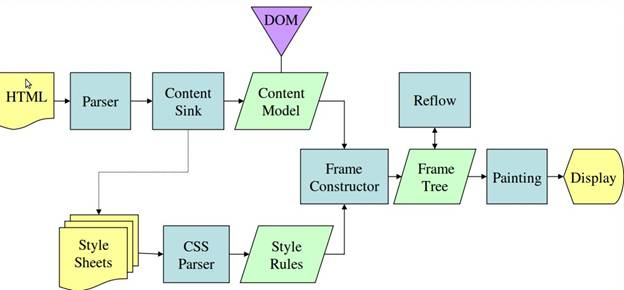
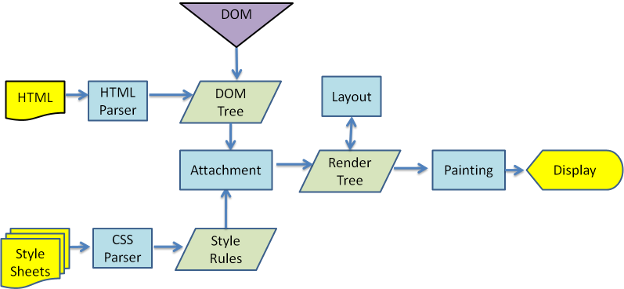

# Browser

References: [HTML5rocks](https://www.html5rocks.com/en/tutorials/internals/howbrowserswork/)

## Rendering Steps in browsers

### Steps for Gecko \(Mozilla\)

### Steps for Webkit \(Chorme and others\)

## FAQs

### Repaint Vs Reflow

A repaint occurs when changes are made to an elements skin that changes visibly, but do not affect its layout.

Examples of this include outline, visibility, background, or color. According to Opera, repaint is expensive because the browser must verify the visibility of all other nodes in the DOM tree.

A reflow is even more critical to performance because it involves changes that affect the layout of a portion of the page \(or the whole page\).

Examples that cause reflows include: adding or removing content, explicitly or implicitly changing width, height, font-family, font-size and more.

