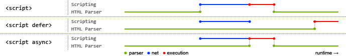

# Dom Events

## 1. document.readyState

RefLink: [MDN](https://developer.mozilla.org/en-US/docs/Web/API/Document/readyState)

```javascript
document.onreadystatechange = function () {
  switch(document.readyState) {
    case 'loading':
      // // The document is still loading.
      break;
    case 'interactive':
      // document is parsed and dom is accessible now
      // but not the sub-resources, images, etc
      // Alternative to document's DOMContentLoaded event
      initLoader();
      break;
    case 'complete':
      // document is completely loaded
      // alternative to document.onload
      initApplication();
      break;
  }
}
```

Order of events

* readystate: loading
* readystate: interactive
* DOMContentLoaded
* readystate: complete
* load

### Related Terms

#### DOMContentLoaded event

The `DOMContentLoaded` event fires when the initial HTML document has been completely loaded and parsed, without waiting for stylesheets, images, and subframes to finish loading.

```javascript
window.addEventListener('DOMContentLoaded', (event) => {
    console.log('DOM fully loaded and parsed');
});
```

#### Load Event

The `load` event is fired when the whole page has loaded, including all dependent resources such as stylesheets and images.

## 2. window.onload vs document.onload

window.onload is fired when DOM is ready and all the contents including images, css, scripts, sub-frames, etc. finished loaded. This means everything is loaded.

document.onload is fired when DOM \(DOM tree built from markup code within the document\)is ready which can be prior to images and other external content is loaded.

## 3. createDocumentFragment

Creates a new empty DocumentFragment into which DOM nodes can be added to build an offscreen DOM tree.

DocumentFragments are DOM Node objects which are never part of the main DOM tree.

**Benifits :** If you are changing dom that cause expensive reflow, you can avoid it by using documentFragment as it is managed in the memory.

```javascript
var fragment = document.createDocumentFragment();
```

## 4. Reflow

[Read this article](https://sites.google.com/site/getsnippet/javascript/dom/repaints-and-reflows-manipulating-the-dom-responsibly)

A reflow computes the layout of the page. A reflow on an element recomputes the dimensions and position of the element, and it also triggers further reflows on that element’s children, ancestors and elements that appear after it in the DOM.

### Triggers for reflow

* insert, remove or update an element in the DOM
* modify content on the page, e.g. the text in an input box
* move a DOM element
* animate a DOM element
* take measurements of an element such as offsetHeight or getComputedStyle
* change a CSS style
* change the className of an element
* add or remove a stylesheet
* resize the window
* scroll
* Changing the font
* Activation of CSS pseudo classes such as :hover \(in IE the activation of the pseudo class of a sibling\)
* Setting a property of the style attribute.

## 4. Repaint

repaint happens when you change the look of an element.

### Triggers

* change background color
* change text color
* visibility hidden
* Reflow

## 5. Why avoid use `table`

tables often require multiple passes before the layout is completely established because they are one of the rare cases where elements can affect the display of other elements that came before them on the DOM.

## 6. Event Bubbling and Capturing

The way browser find out where you have clicked are as follows \(assume you clicked on a cell\)-

* **Capture:** When you clicked, browser knows a click event occurred. It starts from the window \(lowest level/root of your website\), then goes to document, then html root tag, then body, then its children... its trying to reach the the as lowest level of element as possible. This is called capture phase \(phase -1\).
* **Target:** When browser reach the lowest level of element. In this case, you have clicked on a table cell \(table data\) hence target would be "td" tag. Then browser checks whether you have any click handler attached to this element. If there is any, browser executes that click hander. This is called target phase \(phase -2\).
* **Bubbling:** After firing click hander attached to "td", browser walks toward root. One level upward and check whether there is any click handler attached with table row \("tr" element\). If there is any it will execute that. Then it goes to tbody, table, body, html, document, window. In this stage its moving upward and this is called event bubbling or bubbling phase \(phase-3\). Please note that, you clicked on cell but all the event handler with parent elements will be fired. This is actually very powerful \(check event delegation\)

## 7. Event Delegation

## 8. async & defer attributes

Note: both attributes will be ignored for inline script tag.

* **normal :** When reaches the script tag, pauses the dom parsing, downloads script, executes it, and resume dom parsing 
* **async :** When reaches the script tag, initiates the download for script and continues parsing, as soon as the script is downloaded, pauses the dom parsing and executes the script and then resumes parsing
* **defer :** When reaches the script tag, initiates the download for the script and continues parsing, once the parsing is done, it will execute the script. \(basically deferred script execution till the dom is parsed\) 

### For multiple scripts with same attributes of defer

* Scripts with the defer attribute will execute in the order in which they appear in the document.
* Scripts with the defer attribute will prevent the DOMContentLoaded event from firing until the script has loaded and finished evaluating.

Reference: [MDN](https://developer.mozilla.org/en-US/docs/Web/HTML/Element/script)

 

## 9. stopPropagation vs stopImmediatePropagation

* `event.stopPropagation()` will prevent any parent handlers from being executed.
* `event.stopImmediatePropagation()` will prevent any parent handlers and also any other handlers from executing.
* `event.cancelable` to check whether an event is cancelable or not. It return boolean
* `event.preventDefault()`: Calling preventDefault\(\) during any stage of event flow cancels the event, meaning that any default action normally taken by the implementation as a result of the event will not occur. Calling preventDefault\(\) for a non-cancelable event has no effect.

Example for Cancellable & Non-cancelable events: \(For detailed list see [wiki](https://en.wikipedia.org/wiki/DOM_events#HTML_events)\)

* All mouse events are cancellable except: dragleave & dragend
* All keyboard events are cancellable
* All HTML/frame events are non-cancellable \(e.g load, unload, abort, error, resize, scroll\)
* All HTML Form events are non-cancellable other than submit event. eg. select, change, focus, blur.
* User interface events, DomActivated is cancellable. Other event like focusin and focusout are non-cancellable.
* All Mutation Events are non-cancellable: eg. DOMSubtreeModified, DOMNodeInserted, DOMNodeRemoved, DOMNodeRemovedFromDocument, DOMNodeInsertedIntoDocument, DOMAttrModified, DOMCharacterDataModified
* All Progress events are non-cancellable. e.g. loadstart, progress, error, abort, load, loadend.

## 10. Custom Events

Such events are commonly called `synthetic events`, as opposed to the events fired by the browser itself.

Creating event using the `Event` constructor

```javascript
var event = new Event('build');

// Listen for the event.
elem.addEventListener('build', function (e) { /* ... */ }, false);

// Dispatch the event.
elem.dispatchEvent(event);
```

If you want to add some additional data to the event, you will need to use `CustomEvent` constructor instead.

```javascript
var event = new CustomEvent('build', { detail: "some data"});
// if you want to control bubbling of the event
const eventAwesome = new CustomEvent('awesome', {
  bubbles: true,
  detail: {key: "any data format in details key"}
});
```

### Simulating built-in events

```javascript
function simulateClick() {
  var event = new MouseEvent('click', {
    view: window,
    bubbles: true,
    cancelable: true
  });
  var cb = document.getElementById('checkbox'); 
  var cancelled = !cb.dispatchEvent(event);
  if (cancelled) {
    // A handler called preventDefault.
    alert("cancelled");
  } else {
    // None of the handlers called preventDefault.
    alert("not cancelled");
  }
}
```

