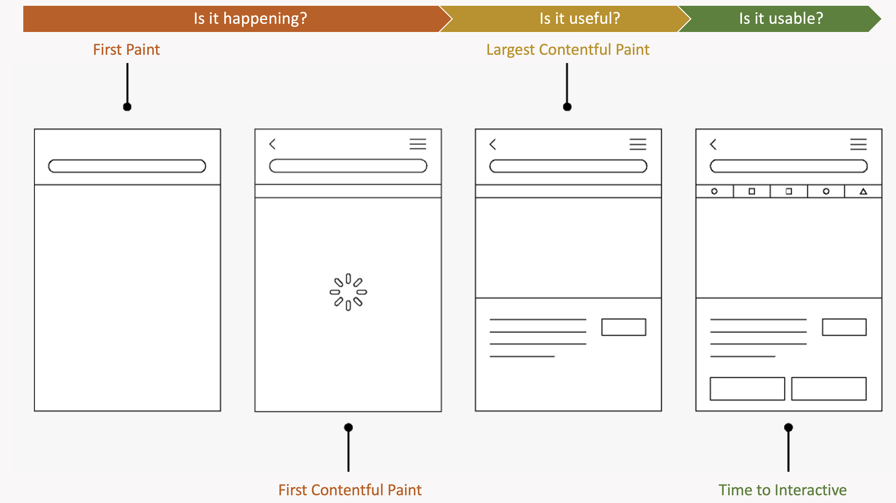

# Web Performance - What, Why & How

## What is Web Performance?

Web performance is all about making sites fast, including making the slow ones seem fast. It includes both objective measurements like time to load, frames per second, and time to become interactive, and subjective experiences of how long it felt like it took the content to load.

When a user navigates to a page, they are looking out for a certain type of feedback and experience. Below are the most critical questions that the user might have when visiting a site.

* Is it happening?: Did the navigation happen successfully? Has the server responded?
* Is it useful?: Did sufficient content rendered that I can engage with?
* Is it usable?: Can I interact with the page or is it still loading?
* Is it Delightful?: Are the interactions smooth and natural, free of lag, and jank?

> Ultimately, user-perceived performance is the only performance that matters. - [MDN](https://developer.mozilla.org/en-US/docs/Web/Performance/Fundamentals)

When we talk about Web Performance, below are the major factors that are considered.

#### Startup Performance \(Load time\)

A lot of people talk in terms of "a site took x.yz sec. to load", but it is not a single moment in time, instead it has multiple moments that can change the perception of a site being "fast" or "slow".

Answers to "Is it happening?"

* **First Paint** is the point at which sufficient application resources have been loaded to paint an initial frame.
* **First Contentful Paint** is the point at which the first text or image is painted.

Answers to "Is it Useful?"

* **First Meaningful Paint** is the point at which the primary content of the page has been loaded. \(Deprecated in favor of LCP\)
* The **Largest Contentful Paint** is the point at which the largest text or image is painted. 

Answers to "Is it Usable?"

* **Time to Interactive** is the time it takes to become fully interactive.

#### Runtime Performance

This part of the Performance tries to answer "Is it delightful"

* Responsiveness refers to the time taken by a page to respond to user interaction. Generally, it should be between 50ms to 100ms to make sure the user doesn't feel any lag.
* Framerate: Human eye can detect any lag below 60fps and hence when we are adding animations or transition or scrolling to our application, we need to make sure that it happens at &gt;=60fps which will make a better user experience in terms of smoothness.

#### Memory and Power Usage

Improving memory and power usage is as important as improving startup time. 

Modern CPUs can enter a low-power mode when idle. An application that fires unnecessary timers or keeps unnecessary animations, prevents CPUs from entering low power mode. In a world where most of the users use battery-powered devices such as mobiles, tab, and laptops, power savings are important factors.

When applications are sent to the background, applications should be able to drop as many loaded resources in memory as possible in order to use less memory when running in the background. You can listen to`visibilityChange`event and drop the resources from in-memory and may be stored in browser storage like indexedDB or just cache in the browser. Application getting pushed to the background is now much more common since the usage over phone and tabs has increased.

## Why is Web Performance Important?

Reducing the download and render time of a site improves user experience and user satisfaction and subsequently improving conversion rates and user retention.

Here are some real-world examples of performance improvements:

* [Tokopedia reduced render time from 14s to 2s for 3G connections and saw a 19% increase in visitors, 35% increase in total sessions, 7% increase in new users, 17% increase in active users and 16% increase in sessions per user.](https://wpostats.com/2018/05/30/tokopedia-new-users.html)
* [Rebuilding Pinterest pages for performance resulted in a 40% decrease in wait time, a 15% increase in SEO traffic and a 15% increase in conversion rate to signup.](https://wpostats.com/2017/03/10/pinterest-seo.html)

## How long is too long?

* Load Goal: The site should load "under a second"
* Idling Goal: &lt;= 50ms
* Animation Goal: &gt;=60fps \(&lt;= 16.7ms\) =&gt; includes scripting, reflow and repaint. 6ms is generally taken for reflow and repaint so you have 10ms to do your logic
* Responsiveness: 50-100ms

For metrics:

* LCP = 2.5s - 4.0s
* FID = 100ms - 300ms
* CLS = 0.1 - 0.25

* [https://developer.mozilla.org/en-US/docs/Web/Performance/How\_long\_is\_too\_long](https://developer.mozilla.org/en-US/docs/Web/Performance/How_long_is_too_long)
* [https://web.dev/vitals/](https://web.dev/vitals/)

## How can we measure this?

Real-world performance is highly variable due to differences in users' devices, network connections, and other factors. There are two types of data that you can use to measure this namely Lab data and Field data.

**Lab data** is performance data collected within a controlled environment with a predefined device and network settings, while **Field data** \(also called **Real User Monitoring or RUM**\) is performance data collected from real page loads experienced by your users in the wild.

Measuring Lab data

Lighthouse is the most popular tool to measure Lab data. You can use the "Lighthouse" tab under Chrome Dev Tools. [Read more on Lighthouse.](https://developers.google.com/web/tools/lighthouse/)

Measuring Field data

[Chrome User Experience Report \(CrUX\)](https://developers.google.com/web/tools/chrome-user-experience-report/) provides metrics showing how real-world Chrome users experience popular destinations on the web.

Read "Web Performance Metrics" for details on all the metrics related to web performance, their importance and how can you improve those individual metrics.

Read "Measuring Web Performance" to get details about measuring web performance, why is it essential to measure and how can we measure different metrics.

Read "Lighthouse - Auditing your web application" to know details about the lighthouse, how to use lighthouse and how to understand the reports generated by lighthouse.

## How can we improve web performance?

The performance can be improved by focusing on the below four factors:

#### Reduce overall load time

* This can be achieved using loading only the critical resources on page load and lazy loading all the other resources.
* Using content delivery networks \(CDNs\) also helps in reducing network latency. CDNs are a network of servers spread across the globe and the request is sent to the geographically nearest server and hence the latency of requests is reduced.
* Caching resources whenever possible

#### Making the site usable as soon as possible

This basically means loading the web assets in an order that enables the user to start using the site as soon as possible. The two most common approaches to address this are:

* Above-the-fold design-pattern, where the priority is given on the first fold of the website which is visible on load, and all the content for that are loaded on priority.
* Server-side rendering is an approach where Single Page applications are rendered in server and directly the rendered HTML is sent to the browser which enables users to view the content even before the SPA applications are bootstrapped on the client.

#### Smoothness and Interactivity

* In order to provide a smooth experience at 60fps or more, Javascript animations should be avoided that uses heavy computations.
* Any interaction on the page should be responded to within 50ms - 200ms in order to make sure there is no lagging.

#### Perceived Performance

When an operation is going to take a longer time, it is essential to keep the user engaged by showing some visual tips and messages.

A lot many times, the user interactions requires making network call which inherently is slow. For such use cases, something similar to a progress bar should be shown to give some visual feedback to a user and hence improving the perceived performance instead of not showing anything at all. 

## References

* [https://developer.mozilla.org/en-US/docs/Learn/Performance/What\_is\_web\_performance](https://developer.mozilla.org/en-US/docs/Learn/Performance/What_is_web_performance)
* [https://developer.mozilla.org/en-US/docs/Web/Performance/Fundamentals](https://developer.mozilla.org/en-US/docs/Web/Performance/Fundamentals)
* [https://developer.mozilla.org/en-US/docs/Web/Performance/How\_long\_is\_too\_long](https://developer.mozilla.org/en-US/docs/Web/Performance/How_long_is_too_long)
* [https://web.dev/what-is-speed/](https://web.dev/what-is-speed/)
* [https://web.dev/why-speed-matters/](https://web.dev/why-speed-matters/)
* [https://developer.mozilla.org/en-US/docs/Learn/Performance/why\_web\_performance](https://developer.mozilla.org/en-US/docs/Learn/Performance/why_web_performance)

