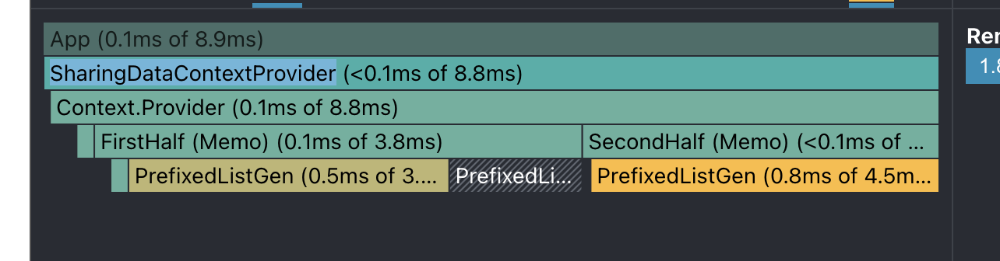
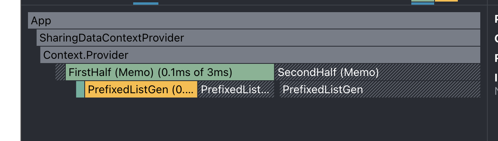
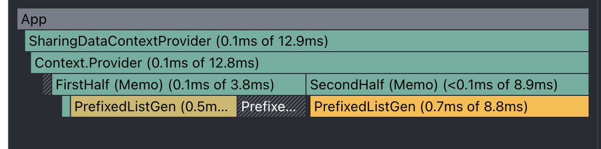

# Improving React.Context Performance

How are going to do this session:

* Discuss some pre-requisites
* Code

You will need a chrome browser with react's dev-tools installed.

### Ground Leveling

But before we start, I would like to level the ground.

#### Understanding Re-render

There are basically two phases.

* The r**ender phase** determines what changes need to be made to e.g. the DOM. During this phase, React calls render and then compares the result to the previous render.
* The **commit phase** is when React applies any changes. (In the case of React DOM, this is when React inserts, updates, and removes DOM nodes.) React also calls lifecycles like componentDidMount and componentDidUpdate during this phase.

Code Example for explanation

* [CodeSandbox Editor](https://codesandbox.io/s/understanding-render-and-commit-p2xnw?file=/src/App.tsx)
* [Actual Page](https://p2xnw.csb.app)

Quiz

Which buttons will initiate which phases (render and have something to commit)&#x20;

* All Three buttons -> Both
* All Three -> Render, Button 2 -> Both
* Button 1 -> None, Button 2 -> Both, Button 3 -> Render

#### Understanding React Profiler

There is a lot to cover, but we will just talk about the one which will get us started.

Flame Charts

* Each bar in the chart represents a React component
* &#x20;The size and color of the bar represent how long it took to render the component and its children.
* Width -> how much time was spent when the component last rendered
* Color -> color represents how much time was spent as part of the current commit

> Do the demo for Flame Chart for the above page.
>
> Start recording the profiler and press the three buttons in order and compare theme.

Useful links:

* [React hooks flow](https://notes.sujeetjaiswal.com/web/react/react-hooks)
* [React component lifecycle hooks](https://projects.wojtekmaj.pl/react-lifecycle-methods-diagram/)
* [React Profiler Introduction](https://reactjs.org/blog/2018/09/10/introducing-the-react-profiler.html)

### Getting started with Problem

One parent, two children

Children one sets a value that is required by the second child.

Context:

* Local state with an empty string as the initial value
* Exposes state and setState

Top-Level Component:

* Local state. Doesn't read/write to context.
* Memoized First and second child
* Doesn't pass any props
* Wraps everything in the context

First Child:

* Local state - Controlled Input
* On Save - update the context using the setter
* Renders two list - One memoized on regular

Second Child:

* No local state
* Reads from the context using the getter

Common Components:

* Input Component: to take input
* Prefixed List Gen to generate components

#### Stage 1

* [Stage 1 Problem Statement](https://codesandbox.io/s/react-context-basic-implementation-tqgc4?file=/src/App.tsx)

Profiling: Update top level input

When saved is clicked

#### Stage 2

[Stage2 Code](https://codesandbox.io/s/react-context-basic-implementation-improved-cimds?file=/src/context.tsx)

The only change done was memoizing the value&#x20;

#### Stage 3

[Stage3 Code](https://codesandbox.io/s/react-context-split-implementation-zoqdw?file=/src/App.tsx)

